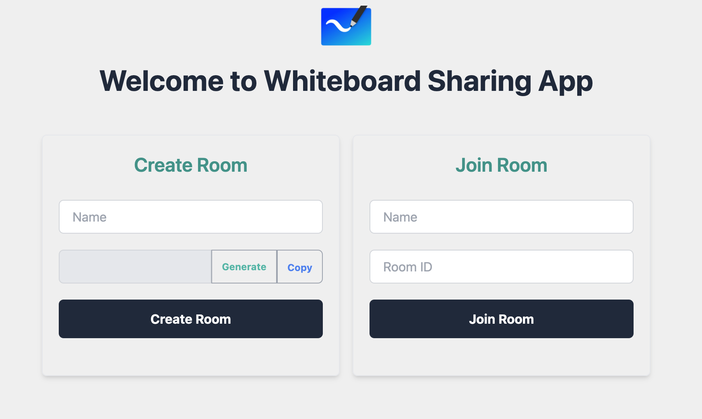

# React-Nodejs Whiteboard App

This is the real-time communication Canvas Whiteboard app using React, Node, Socket.io and focusing on the Canvas. 🎨

---

## Highlights ⭐️

- 🚀 RealTime Communication
- 🚀 Color Picker
- 🚀 Tools Options
- 🚀 Undo/Redo
- 🚀 Clearing Canvas

---

## Used Tools 🛠

- ⚙️ React (Vite)
- ⚙️ Roughjs
- ⚙️ Tailwindcss
- ⚙️ Node (Express)
- ⚙️ Socket.io
- ⚙️ TypeScript
